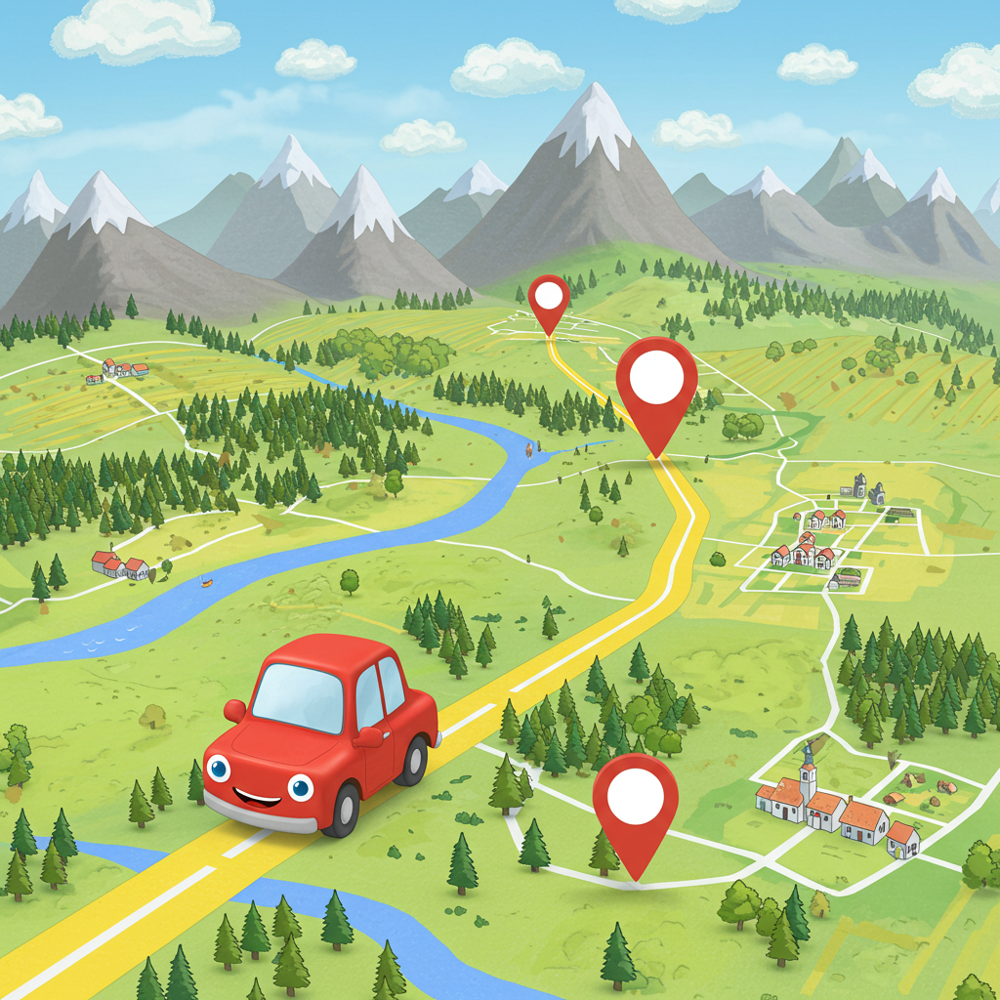

# WhichWay

## Description

### Team:

- Aaron Siemsen
- Vinny Rose
- Aldo Guerrero
- Gustavo Hernandez
- Alan De La Torre

### What we are creating?

We are creating an application that will allow users to plan different kinds of trips using AI. We envision the app to be able to suggest the user many activity possibilities and combinations.
Ranging from camping, hiking, or any outdoor style trips. To in-city activities like places to eat, events, entertainment, and more. The idea is to give the app information like the destination,
time-frame of the trip, preferences, and the AI will be able to put together an itinerary once the user selects the desired activities. Additionally, we are trying to implement avg. driving time
between activities.

### Who were doing it for?

This application can be used by people who want to discover outdoor places away from the city, to people who live in the middle of downtown, but just don't know what there is to do.

### Why we are doing this?

The main reason is to help users save time when it comes to actually doing research on what there is available to them. It would be very useful to have AI find places you might like, as well as
provide you with extra information about the different activities found. This not only helps to save time, but also to make an informed decision on what to do.

## General Information



## Technologies Used

- HTML - HTML5
- CSS - CSS3
- JavaScript - ES15
- React - version 18.2.0
- Python - version 3.11.2
- Flask - version 2.2.5
- SQL - SQL:2023
- Google Authenticator App - version 2.36.0
- DeekSeek - version 2.5

## Features

- "Create a Trip" Feature: Allows the user to customize and put together a trip with activities and an itinerary planned for an an entire day.
  > User Story: I want to use AI to suggest me with activities to do, and help me plan a detailed full-day schedule.

Data Gathering Features:

- "Location" Feature: Give the app the destination so that the AI can start gathering a list of activities within that location.

  > User Story: As a user, I want to only get a list of activities within a 20-50 mile radius.

- "Budgeting" Feature: Give the application your budget estimate so that you can make better financial decisions.

  > User Story: As a budget-conscious traveler, I want to set a total budget for my trip in the trip planning app, so that every activity, accommodation, or expense I add to my itinerary automatically deducts from my budget, helping me stay on track financially.

- "Select Activities" Feature: The AI will categorize different variations of activities (places to eat, entertainment).
  > User Story: As a user, I want the AI to give me a list of things to do. I want them to be categorized in a way that makes sense so that I can pick 1, 2 or even 3 from the same category.

Additional Features:

- "Create Itinerary" Feature: This feature will put together the selected activities, and come up with different versions of itineraries (Times spent at activities will vary). The AI will also find driving times between activities.

  > User Story: As a user, I want the AI to put together different options of itineraries, with the previous activities I selected. I want the AI create different times to spend at these activites and mix these around for each itinerary, and I also want it to give me driving times between activites.

- "Add People to my Trip" Feature: This feature allows users to invite others to join their trip and collaborate on planning.

  > User Story: As a user, I want to add people to my trip so they can view and edit the itinerary. The feature should allow me to invite others via email or a shared link, and they should be able to suggest changes or add activities given the proper permissions.

- "View Trips" Features: This feature allows users to see a their planned and previous trips, and access details for each one.
  > User Story: As a trip member, I want to view all my trips in one place so I can quickly access and manage them. The feature should display trip details, including dates, activities, and participants, with an option to edit or delete trips.

# Developer Information

#### Pre-commit Hooks

Pre-commit hooks are ordinary scripts that Git executes when certain events occur in the repository. The pre-commit hook is run first, before you even type in a commit message. It’s used to inspect the snapshot that’s about to be committed, to see if you’ve forgotten something, to make sure tests run, or to examine whatever you need to inspect in the code.

You can format your python files before committing by running `make fmt` as this will save you some time by not having to type `git add .` and `git commit -m "commit message"` twice:

In VSCode using Git:

### FOR MAC

- Check if Make is installed:

```
make --version
```

- Install Make if not installed:

```
brew install make
```

- If you dont have a '/venv/' directory run the following:

```
python -m venv venv
```

- Activate your environment:

```
source ./venv/bin/activate
```

- Install pre-commit:

```Python
pip install pre-commit
```

### FOR WINDOWS

- Check if Make is installed:

```
make --version
```

- Install Make if not installed:

```
choco install make
```

- If you dont have a '/venv/' directory run the following:

```
python -m venv venv
```

- Activate your environment:

```
source ./venv/Scripts/activate
```

- Install pre-commit:

```Python
pip install pre-commit
```

### BEFORE `git add .`

- Run the make script:

```Python
make fmt
```

### Install icons:

- On terminal run:

```
npm install @mui/icons-material @mui/material @emotion/styled @emotion/react
```

---
# Contributions:
### **Alan**: "Built UI and backend functionality for login, signup, & forgot password pages, users can signup with or without google, login, and remain logged in. Built a side bar for homepage"

  - `Jira Task: Design the Authentication UI
    - [WW-4](https://cs3398-betazoids-spring.atlassian.net/browse/WW-4), 
      [BitBucket](https://bitbucket.org/%7B89569452-9506-45bd-9610-41c9a67ad57b%7D/%7B90ef6dc6-a3fc-42bd-84dc-3ab912f8ab2d%7D/pull-requests/4) Got Deleted On Accident

  - `Jira Task: Implement Authentication
    - [WW-5](https://cs3398-betazoids-spring.atlassian.net/browse/WW-5), 
      [BitBucket](https://bitbucket.org/cs3398-betazoids-s25/whichway/src/WW-5-task-2-implement-authentication/)

  - `Jira Task: Implement User Session Management
    - [WW-6](https://cs3398-betazoids-spring.atlassian.net/browse/WW-6), 
      [BitBucket](https://bitbucket.org/cs3398-betazoids-s25/whichway/src/WW-6-task-3-implement-user-session-manag/)

  - `Jira Task: Integrate Error Handling & Notifications
    - [WW-7](https://cs3398-betazoids-spring.atlassian.net/browse/WW-7), 
      [BitBucket](https://bitbucket.org/cs3398-betazoids-s25/whichway/src/WW-7-task-4-integrate-error-handling-not/)

  - `Jira Task: Setup Database for Logged In Users
    - [WW-8](https://cs3398-betazoids-spring.atlassian.net/browse/WW-8), 
      [BitBucket](https://bitbucket.org/cs3398-betazoids-s25/whichway/src/WW-8-task-5-setup-database-for-logged-in/)
      
  - `Jira Task: Implement Sidebar for Homepage
    - [WW-40](https://cs3398-betazoids-spring.atlassian.net/browse/WW-40), 
      [BitBucket](https://bitbucket.org/cs3398-betazoids-s25/whichway/src/WW-40-task-5-implement-sidebar-for-homep/)

### **Vinny**: Created a budget and cost handling system and worked with Gustavo to create a navigation bar.

  - `Task 3: Develop Interactive UI Elements
    - [WW-38](https://cs3398-betazoids-spring.atlassian.net/browse/WW-38),
    [BitBucket](https://bitbucket.org/cs3398-betazoids-s25/whichway/branch/WW-38-task-3-develop-interactive-ui-elem)

  - `Task 1: Research JavaScript and React
    - [WW-64](https://cs3398-betazoids-spring.atlassian.net/browse/WW-64),
    No commit - Research task

  - `Task 2: Frontend Input for Budget and Cost Updates
    - [WW-65](https://cs3398-betazoids-spring.atlassian.net/browse/WW-65),
    [BitBucket](https://bitbucket.org/cs3398-betazoids-s25/whichway/src/WW-65-task-2-frontend-input-for-budget-a/)
  
  - `Task 3: Storing Budgets and Costs
    - [WW-66](https://cs3398-betazoids-spring.atlassian.net/browse/WW-66),
    [BitBucket](https://bitbucket.org/cs3398-betazoids-s25/whichway/src/WW-66-task-3-storing-budgets-and-costs/)
    
### **Aaron**: Designed and implemented page UI for the 'Create Trip' page where users will be able to create their trips with unique seletions/modifications. Created functionality of selecting activities to add to a user itinerary. 

  - `Task 1: Create the Trip Input Page UI (Frontend - React):
    - [WW-46](https://cs3398-betazoids-spring.atlassian.net/browse/WW-46)
    [BitBucket](https://bitbucket.org/cs3398-betazoids-s25/whichway/branch/WW-46-task-1-create-the-trip-input-page)

  - `Task 5: Enable Navigation to the Itinerary Page:
    - [WW-50](https://cs3398-betazoids-spring.atlassian.net/browse/WW-50)
    [BitBucket](https://bitbucket.org/cs3398-betazoids-s25/whichway/branch/WW-50-task-5-enable-navigation-to-the-it)

  - `Task 3: Build the Activity Selection Component:
    - [WW-48](https://cs3398-betazoids-spring.atlassian.net/browse/WW-48)
    [BitBucket](https://bitbucket.org/cs3398-betazoids-s25/whichway/branch/WW-48-task-3-build-the-activity-selectio)

  - `Task 4: Adding visual representation of current activity selections:
    - [WW-39](https://cs3398-betazoids-spring.atlassian.net/browse/WW-39)
    [BitBucket](https://bitbucket.org/cs3398-betazoids-s25/whichway/branch/WW-39-task-4-adding-visual-representatio)
    
### **Gustavo**: Designed the initial wireframe and implemented React components and UI elements for the Home/Routing page. Also created the Data model for User's and Trips.
  - `Task 1: Create Wireframes and UI Mockups:
    - [WW-36](https://cs3398-betazoids-spring.atlassian.net/browse/WW-36)
    [BitBucket](https://bitbucket.org/cs3398-betazoids-s25/whichway/branch/feature/WW-36-task-1-create-wireframes-and-ui-mo)
  - `Task 2: Implement Navigation and Layout Components:
    - [WW-37](https://cs3398-betazoids-spring.atlassian.net/browse/WW-37)
    [BitBucket](https://bitbucket.org/cs3398-betazoids-s25/whichway/branch/WW-37_MergeConflictsWithFix-WW-93)
  - `Task 3: Implement Backend Data Model for Other MetaData ($ Spent, Places Visited, Miles Travelled, etcc.):
    - [WW-23](https://cs3398-betazoids-spring.atlassian.net/browse/WW-23)
    [BitBucket](https://bitbucket.org/cs3398-betazoids-s25/whichway/branch/WW-23-task-3-implement-backend-data-mode)
    

## Next steps

### **Vinny**: 
  - Integrate budget storage with firebase
  - Change CSS of the budget features to be more in line with the rest of CreateTrip page.
  - Integrate API calls for estimating how much an activity would cost.
  
### **Alan**: 
  - Research and learn how to implement the functionality behind 'fetching' activites from OpenAI.
  - Research and implement API calls to Places API in order to get information from places to present to the user.
  - Implement database data fetching for create trip and create itinerary pages.
  - Organize css files and make them local to the pages that use them.
  
### **Aaron**: 
  - Create and establish trip object that is stored in firestore database per user.
  - Add AI integration for activity suggestions and itinerary planning.
  
### **Gustavo**:
  - Assist with implementing synchronization between Users, trips, and the Firestore database. 
  - Setup API calls for getting location information for near by activites, food, and attractions.
  - Implement past/current trips to be fetched from Firestore when a user is logged into the web app.
  - Create and build unit test for React components with the jest framework.

## Retrospective

### What Went Well or maybe not?

  **Team**: 
  
  - Great communication, many team meetings either in a call or in-person.
  - Picked up a rythm and soon began knocking out tasks.
  - All team members were always more than willing to assist anyone else with any problems/concerns another team member had.
  
  **Individual**:
  
  - **Vinny**: I started to understand jsx near the end of the sprint, and I became very efficient at my later tasks
  - **Alan**: I got a good grasp of react and firebase, and I was able to provide a lot of support to my team on various things
  - **Aaron**: Near the beginning of the sprint it was very difficult to get a grasp on the structure and flow of React, making my progress slow at the beginning.
  - **Gustavo**: During the sprint I had to learn and understand HTML, CSS, React, and Firestore which was a bigger hurtle than anticipated. But once I got over it, I was able to explain Firestore and React OOP structure to my teammates.  
  
### What Might Be Impeding Us from Performing Better?

   **Team**: 
  - We're all doing our own thing, so there are parts of jsx that are understood by some more than others, making helping each other a little more difficult
  
  - We might not organize ourselves to find time in the day to work on the project, nor are we doing as much research as we should
  
  - We're all doing our own thing, so there are parts of jsx that are understood by some more than others, making helping each other a little more difficult
  
### What Can I do to Improve?

   **Individual**: 
  
  - **Vinny**: Learn CSS more since I was relying on the CSS that someone else made for my pages
 
  - **Alan**: Read more documentation and find resources that can help the team and myself
  
  - **Aaron**: Gain a deeper understanding of firebase and firestore; this would show itself in cleaner and more efficient database storage and management
    
    **Gustavo**: Research and expand my knowledge over Firestore implementation for our user and trips data.