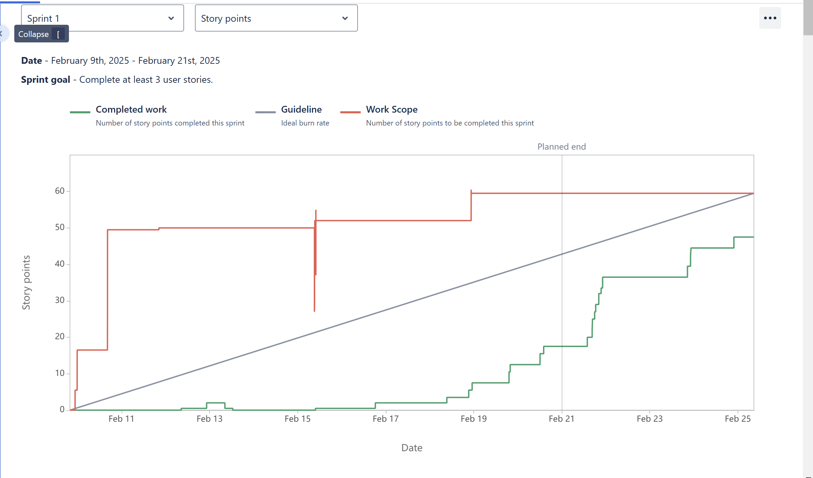
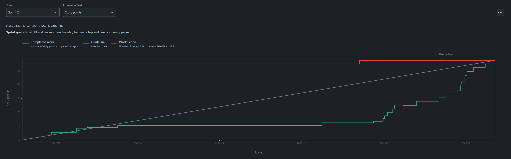
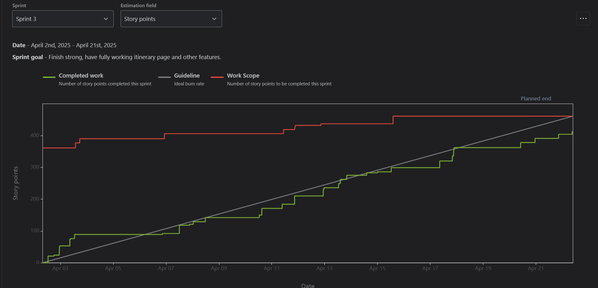

# WhichWay

## Description

### Team:

- Aaron Siemsen
- Vinny Rose
- Aldo Guerrero
- Gustavo Hernandez
- Alan De La Torre

### What we are creating?

We are creating an application that will allow users to plan different kinds of trips using AI. We envision the app to be able to suggest the user many activity possibilities and combinations.
Ranging from camping, hiking, or any outdoor style trips. To in-city activities like places to eat, events, entertainment, and more. The idea is to give the app information like the destination,
time-frame of the trip, preferences, and the AI will be able to put together an itinerary once the user selects the desired activities. Additionally, we are trying to implement avg. driving time
between activities.

### Who were doing it for?

This application can be used by people who want to discover outdoor places away from the city, to people who live in the middle of downtown, but just don't know what there is to do.

### Why we are doing this?

The main reason is to help users save time when it comes to actually doing research on what there is available to them. It would be very useful to have AI find places you might like, as well as
provide you with extra information about the different activities found. This not only helps to save time, but also to make an informed decision on what to do.

## General Information


## Technologies Used

- HTML - HTML5
- CSS - CSS3
- JavaScript - ES15
- React - version 18.2.0
- Python - version 3.11.2
- Firebase Hosting
- Firebase Authentication
- Firebase Firestore DB

## Features

- "Create a Trip" Feature: Allows the user to customize and put together a trip with activities and an itinerary planned for an an entire day.
  > User Story: I want to use AI to suggest me with activities to do, and help me plan a detailed full-day schedule.

Data Gathering Features:

- "Location" Feature: Give the app the destination so that the AI can start gathering a list of activities within that location.

  > User Story: As a user, I want to only get a list of activities within a 20-50 mile radius.

- "Budgeting" Feature: Give the application your budget estimate so that you can make better financial decisions.

  > User Story: As a budget-conscious traveler, I want to set a total budget for my trip in the trip planning app, so that every activity, accommodation, or expense I add to my itinerary automatically deducts from my budget, helping me stay on track financially.

- "Select Activities" Feature: The AI will categorize different variations of activities (places to eat, entertainment).
  > User Story: As a user, I want the AI to give me a list of things to do. I want them to be categorized in a way that makes sense so that I can pick 1, 2 or even 3 from the same category.

Additional Features:

- "Create Itinerary" Feature: This feature will put together the selected activities, and come up with different versions of itineraries (Times spent at activities will vary). The AI will also find driving times between activities.

  > User Story: As a user, I want the AI to put together different options of itineraries, with the previous activities I selected. I want the AI create different times to spend at these activites and mix these around for each itinerary, and I also want it to give me driving times between activites.

- "Add People to my Trip" Feature: This feature allows users to invite others to join their trip and collaborate on planning.

  > User Story: As a user, I want to add people to my trip so they can view and edit the itinerary. The feature should allow me to invite others via email or a shared link, and they should be able to suggest changes or add activities given the proper permissions.

- "View Trips" Features: This feature allows users to see a their planned and previous trips, and access details for each one.
  > User Story: As a trip member, I want to view all my trips in one place so I can quickly access and manage them. The feature should display trip details, including dates, activities, and participants, with an option to edit or delete trips.

# Developer Information

#### Pre-commit Hooks

Pre-commit hooks are ordinary scripts that Git executes when certain events occur in the repository. The pre-commit hook is run first, before you even type in a commit message. It’s used to inspect the snapshot that’s about to be committed, to see if you’ve forgotten something, to make sure tests run, or to examine whatever you need to inspect in the code.

You can format your python files before committing by running `make fmt` as this will save you some time by not having to type `git add .` and `git commit -m "commit message"` twice:

In VSCode using Git:

### FOR MAC

- Check if Make is installed:

```
make --version
```

- Install Make if not installed:

```
brew install make
```

- If you dont have a '/venv/' directory run the following:

```
python -m venv venv
```

- Activate your environment:

```
source ./venv/bin/activate
```

- Install pre-commit:

```Python
pip install pre-commit
```

### FOR WINDOWS

- Check if Make is installed:

```
make --version
```

- Install Make if not installed:

```
choco install make
```

- If you dont have a '/venv/' directory run the following:

```
python -m venv venv
```

- Activate your environment:

```
source ./venv/Scripts/activate
```

- Install pre-commit:

```Python
pip install pre-commit
```

### BEFORE `git add .`

- Run the make script:

```Python
make fmt
```

### Install icons:

- On terminal run:

```
npm install @mui/icons-material @mui/material @emotion/styled @emotion/react
npm install lucide-react
npm install react-toastify
npm install axios
npm install openai
npm install html2canvas
npm install jspdf
npm install util
```

### Unit Tests:

```
npm install
```
then
```
npm test
```
see coverage
```
npm run coverage
```
To view in your browser:
```
# On Mac
open coverage/lcov-report/index.html

# On Windows
start coverage/lcov-report/index.html
```


### Build:

- Made changes? You should first do:

```
npm run dev
```
or
```
npm run preview
```

- If those changes look good:

```
npm run deploy
```

- You might need to run this command if you just pulled for the first time:

```
firebase use whichway-9040f
```

---
# Sprint 1
## Contributions:
### **Alan**: "Built UI and backend functionality for login, signup, & forgot password pages, users can signup with or without google, login, and remain logged in. Built a side bar for homepage"

  - Jira Task: Design the Authentication UI
    - [WW-4](https://cs3398-betazoids-spring.atlassian.net/browse/WW-4),
      [BitBucket](https://bitbucket.org/%7B89569452-9506-45bd-9610-41c9a67ad57b%7D/%7B90ef6dc6-a3fc-42bd-84dc-3ab912f8ab2d%7D/pull-requests/4) Got Deleted On Accident

  - Jira Task: Implement Authentication
    - [WW-5](https://cs3398-betazoids-spring.atlassian.net/browse/WW-5),
      [BitBucket](https://bitbucket.org/cs3398-betazoids-s25/whichway/src/WW-5-task-2-implement-authentication/)

  - Jira Task: Implement User Session Management
    - [WW-6](https://cs3398-betazoids-spring.atlassian.net/browse/WW-6),
      [BitBucket](https://bitbucket.org/cs3398-betazoids-s25/whichway/src/WW-6-task-3-implement-user-session-manag/)

  - Jira Task: Integrate Error Handling & Notifications
    - [WW-7](https://cs3398-betazoids-spring.atlassian.net/browse/WW-7),
      [BitBucket](https://bitbucket.org/cs3398-betazoids-s25/whichway/src/WW-7-task-4-integrate-error-handling-not/)

  - Jira Task: Setup Database for Logged In Users
    - [WW-8](https://cs3398-betazoids-spring.atlassian.net/browse/WW-8),
      [BitBucket](https://bitbucket.org/cs3398-betazoids-s25/whichway/src/WW-8-task-5-setup-database-for-logged-in/)

  - Jira Task: Implement Sidebar for Homepage
    - [WW-40](https://cs3398-betazoids-spring.atlassian.net/browse/WW-40),
      [BitBucket](https://bitbucket.org/cs3398-betazoids-s25/whichway/src/WW-40-task-5-implement-sidebar-for-homep/)

### **Vinny**: Created a budget and cost handling system and worked with Gustavo to create a navigation bar.

  - Task 3: Develop Interactive UI Elements
    - [WW-38](https://cs3398-betazoids-spring.atlassian.net/browse/WW-38),
    [BitBucket](https://bitbucket.org/cs3398-betazoids-s25/whichway/branch/WW-38-task-3-develop-interactive-ui-elem)

  - Task 1: Research JavaScript and React
    - [WW-64](https://cs3398-betazoids-spring.atlassian.net/browse/WW-64),
    No commit - Research task

  - Task 2: Frontend Input for Budget and Cost Updates
    - [WW-65](https://cs3398-betazoids-spring.atlassian.net/browse/WW-65),
    [BitBucket](https://bitbucket.org/cs3398-betazoids-s25/whichway/src/WW-65-task-2-frontend-input-for-budget-a/)

  - Task 3: Storing Budgets and Costs
    - [WW-66](https://cs3398-betazoids-spring.atlassian.net/browse/WW-66),
    [BitBucket](https://bitbucket.org/cs3398-betazoids-s25/whichway/src/WW-66-task-3-storing-budgets-and-costs/)

### **Aaron**: Designed and implemented page UI for the 'Create Trip' page where users will be able to create their trips with unique seletions/modifications. Created functionality of selecting activities to add to a user itinerary.

  - Task 1: Create the Trip Input Page UI (Frontend - React):
    - [WW-46](https://cs3398-betazoids-spring.atlassian.net/browse/WW-46)
    [BitBucket](https://bitbucket.org/cs3398-betazoids-s25/whichway/branch/WW-46-task-1-create-the-trip-input-page)

  - Task 5: Enable Navigation to the Itinerary Page:
    - [WW-50](https://cs3398-betazoids-spring.atlassian.net/browse/WW-50)
    [BitBucket](https://bitbucket.org/cs3398-betazoids-s25/whichway/branch/WW-50-task-5-enable-navigation-to-the-it)

  - Task 3: Build the Activity Selection Component:
    - [WW-48](https://cs3398-betazoids-spring.atlassian.net/browse/WW-48)
    [BitBucket](https://bitbucket.org/cs3398-betazoids-s25/whichway/branch/WW-48-task-3-build-the-activity-selectio)

  - Task 4: Adding visual representation of current activity selections:
    - [WW-39](https://cs3398-betazoids-spring.atlassian.net/browse/WW-39)
    [BitBucket](https://bitbucket.org/cs3398-betazoids-s25/whichway/branch/WW-39-task-4-adding-visual-representatio)

### **Gustavo**: Designed the initial wireframe and implemented React components and UI elements for the Home/Routing page. Also created the Data model for User's and Trips.
  - Task 1: Create Wireframes and UI Mockups:
    - [WW-36](https://cs3398-betazoids-spring.atlassian.net/browse/WW-36)
    [BitBucket](https://bitbucket.org/cs3398-betazoids-s25/whichway/branch/feature/WW-36-task-1-create-wireframes-and-ui-mo)
  - Task 2: Implement Navigation and Layout Components:
    - [WW-37](https://cs3398-betazoids-spring.atlassian.net/browse/WW-37)
    [BitBucket](https://bitbucket.org/cs3398-betazoids-s25/whichway/branch/WW-37_MergeConflictsWithFix-WW-93)
  - Task 3: Implement Backend Data Model for Other MetaData ($ Spent, Places Visited, Miles Travelled, etcc.):
    - [WW-23](https://cs3398-betazoids-spring.atlassian.net/browse/WW-23)
    [BitBucket](https://bitbucket.org/cs3398-betazoids-s25/whichway/branch/WW-23-task-3-implement-backend-data-mode)

### **Aldo Guerrero ** "Built UI and backend functionality for the Trip Dashbaord using React components, helped configure Firebase and Firestore, and made the page interactive to make Trip name, destination, and date.
  - Task 4 : Implement Frontend to Display Metadata:
    - [WW-22]https://cs3398-betazoids-spring.atlassian.net/browse/WW-22
    [BitBucket]https://bitbucket.org/cs3398-betazoids-s25/whichway/branch/WW-22-task-4-implement-frontend-to-display-metadata

  - Task 2: Implement Backend Data Model & API for Recent Trips:
    - [WW-21]https://cs3398-betazoids-spring.atlassian.net/browse/WW-21
    [BitBucket]https://bitbucket.org/cs3398-betazoids-s25/whichway/branch/WW-21-task-2-implement-backend-data-model-api-for-recent-trips

  - Task 1 : Implement Frontend to Display Metadata:
    - [WW-20]https://cs3398-betazoids-spring.atlassian.net/browse/WW-20
    [BitBucket]https://bitbucket.org/cs3398-betazoids-s25/whichway/branch/WW-20-task-1-design-the-recent-trips-ui

## Next steps

### **Vinny**:
  - Integrate budget storage with firebase
  - Change CSS of the budget features to be more in line with the rest of CreateTrip page.
  - Integrate API calls for estimating how much an activity would cost.

### **Alan**:
  - Research and learn how to implement the functionality behind 'fetching' activites from OpenAI.
  - Research and implement API calls to Places API in order to get information from places to present to the user.
  - Implement database data fetching for create trip and create itinerary pages.
  - Organize css files and make them local to the pages that use them.

### **Aaron**:
  - Create and establish trip object that is stored in firestore database per user.
  - Add AI integration for activity suggestions and itinerary planning.

### **Gustavo**:
  - Assist with implementing synchronization between Users, trips, and the Firestore database.
  - Setup API calls for getting location information for near by activites, food, and attractions.
  - Implement past/current trips to be fetched from Firestore when a user is logged into the web app.
  - Create and build unit test for React components with the jest framework.

### **Aldo**:
  - Assist in implementing Cloud Firestore for create trip and the trip Dashbaord
  - Collaborate with the team to troubleshoot and resolve any issues with syncing user data and trip information.
  - Optimize Firestore queries for faster data retrieval and better performance in the web app.

## Retrospective

### What Went Well or maybe not?

  **Team**:

  - Great communication, many team meetings either in a call or in-person.
  - Picked up a rythm and soon began knocking out tasks.
  - All team members were always more than willing to assist anyone else with any problems/concerns another team member had.

  **Individual**:

  - **Vinny**: I started to understand jsx near the end of the sprint, and I became very efficient at my later tasks
  - **Alan**: I got a good grasp of react and firebase, and I was able to provide a lot of support to my team on various things
  - **Aaron**: Near the beginning of the sprint it was very difficult to get a grasp on the structure and flow of React, making my progress slow at the beginning.
  - **Gustavo**: During the sprint I had to learn and understand HTML, CSS, React, and Firestore which was a bigger hurtle than anticipated. But once I got over it, I was able to explain Firestore and React OOP structure to my teammates.
  - **Aldo**: I should have written test cases for each class I developed, including those in React and Firebase. This would've helped the team debug.

### What Might Be Impeding Us from Performing Better?

   **Team**:
  - We're all doing our own thing, so there are parts of jsx that are understood by some more than others, making helping each other a little more difficult

  - We might not organize ourselves to find time in the day to work on the project, nor are we doing as much research as we should

  - We're all doing our own thing, so there are parts of jsx that are understood by some more than others, making helping each other a little more difficult

### What Can I do to Improve?

   **Individual**:

  - **Vinny**: Learn CSS more since I was relying on the CSS that someone else made for my pages

  - **Alan**: Read more documentation and find resources that can help the team and myself

  - **Aaron**: Gain a deeper understanding of firebase and firestore; this would show itself in cleaner and more efficient database storage and management

    **Gustavo**: Research and expand my knowledge over Firestore implementation for our user and trips data.

  - **Aldo**: Communicate with my team more efficiently and learn more deeply how React and Firebase can work together.



---
# Sprint 2
## Contributions:
### **Alan**: "Did major refactoring to home pages, specified private and public routes, built UI for create itinerary page, and organized the repository files."

  - Jira Task: Implement fronted
    - [WW-32](https://cs3398-betazoids-spring.atlassian.net/browse/WW-32),
      [BitBucket](https://bitbucket.org/cs3398-betazoids-s25/whichway/pull-requests/58)

  - Jira Task: Troubleshoot issues
    - [WW-34](https://cs3398-betazoids-spring.atlassian.net/browse/WW-34),
      [BitBucket](https://bitbucket.org/cs3398-betazoids-s25/whichway/pull-requests/60)

  - Jira Task: Orginize styling and files
    - [WW-52](https://cs3398-betazoids-spring.atlassian.net/browse/WW-52),
      [BitBucket](https://bitbucket.org/cs3398-betazoids-s25/whichway/pull-requests/39)

  - Jira Task: Create private and public routes
    - [WW-53](https://cs3398-betazoids-spring.atlassian.net/browse/WW-53),
      [BitBucket](https://bitbucket.org/cs3398-betazoids-s25/whichway/pull-requests/41)

  - Jira Task: Build UI for create itinerary
    - [WW-55](https://cs3398-betazoids-spring.atlassian.net/browse/WW-55),
      [BitBucket](https://bitbucket.org/cs3398-betazoids-s25/whichway/pull-requests/52)

  - Jira Task: Refactor other pages
    - [WW-56](https://cs3398-betazoids-spring.atlassian.net/browse/WW-56),
      [BitBucket](https://bitbucket.org/cs3398-betazoids-s25/whichway/pull-requests/46)

### **Vinny**: Refactored UI and fixed bugs pertaining to the Create Trip page, as well as added a new Console Commands feature

  - Task 3: Refactor create trip page UI
    - [WW-54](https://cs3398-betazoids-spring.atlassian.net/browse/WW-54),
    [BitBucket](https://bitbucket.org/%7B%7D/%7B90ef6dc6-a3fc-42bd-84dc-3ab912f8ab2d%7D/branch/WW-54-task-3-refactor-create-trip-page)

  - Create file that holds all console commands
    - [WW-94](https://cs3398-betazoids-spring.atlassian.net/browse/WW-94),
    [BitBucket](https://bitbucket.org/%7B%7D/%7B90ef6dc6-a3fc-42bd-84dc-3ab912f8ab2d%7D/branch/WW-94-create-file-that-holds-console-commands)

  - Task 5: Error Handling and Integration Testing
    - [WW-68](https://cs3398-betazoids-spring.atlassian.net/browse/WW-68),
    [BitBucket](https://bitbucket.org/%7B%7D/%7B90ef6dc6-a3fc-42bd-84dc-3ab912f8ab2d%7D/branch/WW-68-task-5-error-handling-and-integration)

  - Task 4: Budget Validation and Error Handling
    - [WW-67](https://cs3398-betazoids-spring.atlassian.net/browse/WW-67),
    [BitBucket](https://bitbucket.org/%7B%7D/%7B90ef6dc6-a3fc-42bd-84dc-3ab912f8ab2d%7D/branch/WW-67-budget-error-validation-post-activities-change)

### **Aaron**: "Expanded activity UI to show more information to users, gathered all relevant user/trip info to save to database, and implemented openai api call to create an itinerary for the user."

  - Jira Task: Integrate APIs for Itinerary Generation
    - [WW-12](https://cs3398-betazoids-spring.atlassian.net/browse/WW-12)
    [BitBucket](https://bitbucket.org/%7B%7D/%7B90ef6dc6-a3fc-42bd-84dc-3ab912f8ab2d%7D/branch/WW-12-task-2-integrate-apis-for-itinerar)

  - Jira Task: Make data flow
    - [WW-30](https://cs3398-betazoids-spring.atlassian.net/browse/WW-30)
    [BitBucket](https://bitbucket.org/cs3398-betazoids-s25/whichway/branch/WW-50-task-5-enable-navigation-to-the-it)

  - Jira Task: Implement Error Handling and Logging
    - [WW-15](https://cs3398-betazoids-spring.atlassian.net/browse/WW-15)
    [BitBucket](https://bitbucket.org/%7B%7D/%7B90ef6dc6-a3fc-42bd-84dc-3ab912f8ab2d%7D/branch/WW-15-task-5-implement-error-handling-an)

  - Jira Task: Process and Optimize API Responses
    - [WW-13](https://cs3398-betazoids-spring.atlassian.net/browse/WW-13)
    [BitBucket](https://bitbucket.org/%7B%7D/%7B90ef6dc6-a3fc-42bd-84dc-3ab912f8ab2d%7D/branch/WW-13-task-3-process-and-optimize-api-re)

  - Jira Task: Gather parameters (user input)
    - [WW-72](https://cs3398-betazoids-spring.atlassian.net/browse/WW-72)
    [BitBucket](https://bitbucket.org/%7B%7D/%7B90ef6dc6-a3fc-42bd-84dc-3ab912f8ab2d%7D/branch/WW-72-task-1-gather-parameters-user-inpu)

  - Jira Task: Create UI wireframes
    - [WW-31](https://cs3398-betazoids-spring.atlassian.net/browse/WW-31)
    [BitBucket](https://bitbucket.org/%7B%7D/%7B90ef6dc6-a3fc-42bd-84dc-3ab912f8ab2d%7D/branch/WW-31-task-2-create-ui-wireframes)

### **Gustavo**: Integrate Google Location API to request location specific(destination) data. Allowing us to show the user's near by activities. While having data and user input saved in Firestore. .
  - Task 5: Error Handling for Backend & Frontend:
    - [WW-24](https://cs3398-betazoids-spring.atlassian.net/browse/WW-24)
    [BitBucket](https://bitbucket.org/cs3398-betazoids-s25/whichway/branch/WW-24-ErrorHandlingFrontandBackends)
  - Task 3: Send API request:
    - [WW-74](https://cs3398-betazoids-spring.atlassian.net/browse/WW-74)
    [BitBucket](https://bitbucket.org/cs3398-betazoids-s25/%7B90ef6dc6-a3fc-42bd-84dc-3ab912f8ab2d%7D/branch/WW-74-task-3-send-api-request)
  - Task 4: Implement Data Persistence with Firebase:
    - [WW-49](https://cs3398-betazoids-spring.atlassian.net/browse/WW-49)
    [BitBucket](https://bitbucket.org/cs3398-betazoids-s25/whichway/branch/WW-49-task-4-implement-data-persistence-)
  - Task 4: Implement backend:
    - [WW-33](https://cs3398-betazoids-spring.atlassian.net/browse/WW-33)
    [BitBucket](https://bitbucket.org/cs3398-betazoids-s25/%7B90ef6dc6-a3fc-42bd-84dc-3ab912f8ab2d%7D/branch/WW-33-task-4-implement-backend)

### **Aldo Guerrero ** Developed and managed input logic for Trip Preferences, parsed user input data, and troubleshooted issues.
  - Task 1: Develop Input Handling Logic:
    - [WW-11]https://cs3398-betazoids-spring.atlassian.net/browse/WW-11
    [BitBucket]https://bitbucket.org/cs3398-betazoids-s25/whichway/pull-requests/40

  - Task 2: Parse and Store from Location API:
    - [WW-47]https://cs3398-betazoids-spring.atlassian.net/browse/WW-47
    [BitBucket]https://bitbucket.org/cs3398-betazoids-s25/whichway/pull-requests/51

  - Task 2: Troubleshoot issues with selected activities:
    - [WW-73]https://cs3398-betazoids-spring.atlassian.net/browse/WW-73
    [BitBucket]https://bitbucket.org/cs3398-betazoids-s25/whichway/pull-requests/69

  - Task 4: Troubleshoot issues with request:
    - [WW-75]https://cs3398-betazoids-spring.atlassian.net/browse/WW-75
    [BitBucket]https://bitbucket.org/cs3398-betazoids-s25/whichway/pull-requests/62

  - Task 5: Troubleshoot issues with response and handle response data:
    - [WW-76]https://cs3398-betazoids-spring.atlassian.net/browse/WW-76
    [BitBucket]https://bitbucket.org/cs3398-betazoids-s25/whichway/pull-requests/67

## Next steps

### **Vinny**:
  - Take price estimates from google API and use that to affect budget.
  - Help with storing and retrieving data from firestore so that Create Trip and Home page are integrated.
  - Work with my teammates to do more unit testing and fix bugs that way.

### **Alan**:
  - Research and learn how to properly deploy the application.
  - Implement better looking UI for create trip and create itinerary pages.
  - Create UI for Account and Settings pages and fetch appropriate data from db.
  - Help fix bugs in create trip page.

### **Aaron**:
  - Integrate Openai itinerary generation with user data and selections.
  - Assist Aldo and Gustavo with to parse data recieved by API calls in order to further integrate with the activity selections.
  - Create/implement an organization plan for the database to store data in a way that is secure and efficient.
  - Further integrate Google Places API with the activity UI to properly display activity data.

### **Gustavo**:
  - Debug selected activites in the create trip.
  - Choose what data will be seen/shown to the user.
  - Create functions that request document information from firestore to create itenerary, after a user selects and types information of a trip.
  - Assist Aaron with incorporating OpenAI and the Trip data/details from Firestore to generate an itenerary.

### **Aldo**:
  - Assist Gustavo and Aaron parse data being sent and recieved by OpenAI, Google Places and other APIs.
  - Configure and finalize firestore structure so data is linked to the correct collections and documents.
  - Assist in completing unit testing and troubleshooting for frontend/backend.
  - Implement other travel features the webapp should have (Travel Trips, Notifications, etc.)

## Retrospective

## What Went Well or maybe not?

  **Team**:

  - I think we did the main things that we wanted to achieve which was have create trip and create itinerary pages working. But I think we waited too long to get these things working properly

  - The team started with good momentum and managed to finish all of our tasks on time. The quality of our project is a little less than ideal but it is functional.

  - The team started off strong but we let off our foot from the pedal the beginning of the last week of the sprint. We were able to complete many important tasks, and features for the web app.

  - I am satisfied with the overall structure of the app and I think that we have a lot of functional components working as intended. However there are some clashing ideas that interrupt the flow of user interaction with the app.

  - We did a good job working within each others code. We all have a good grasp of which section is "ours" but we still do well working in new code spaces.

  **Individual**:

  - **Vinny**: I managed to estimate my tasks pretty well this time, they never felt too long or too short.

  - **Alan**: Planning early and having a good set of tasks helped out a lot and we stayed organized for the most part.

  - **Aaron**: My individual research of the Openai API helped a lot and gave me good insight into how I wanted to implement it into our application.

  - **Gustavo**: I was able to learn and understand Google Location API. While implementing functions that actively request data given a location. I must work on working on my tasks on time and not blocking others tasks.

  - **Aldo**: Communication, the sharing of ideas, and helping one another was a big improvement this sprint. One thing I can work on is fully understanding the parsing of data, firestore, and any backend functionalities.

## What Might Be Impeding Us from Performing Better?

   **Team**:

  - We need to lower procrastination, although we have other things to take care of we still need to make sure to start early on our tasks.

  - We often underestimate our tasks. We need to plan and edit our tasks more effectively.

  - We need to work on starting on tasks late and not effectively communicating with each others of our completed tasks.

  - We need better communication on the expectations of our own work and others so we are all working towards the same vision.

  -

## What Can I do to Improve?

   **Individual**:

  - **Vinny**: I feel like I still procrastinated my tasks a little too hard thinking they would be longer than they were. I want to trust my estimates more.

  - **Alan**: I need to dedicate appropriate time for challenging tasks and also relay useful information to my team.

  - **Aaron**: I plan to carefully anaylyze all of my tasks before starting to work. This will allow me to lay out an order and timeline for how I will complete the next sprint, making me a more reliable team member.

  - **Gustavo**: I must stop procrastinating my tasks. I pushed off completing the Google Location API, which was more difficult than imagined.

  - **Aldo**: I can improve the quality of my work by talking to my team more often and encourage constructive criticism from them. In addition, I need to dedicate more time on my tasks.

### AI:
  - **Description**: AI mostly helps us create and correct code when we experience issues like not being familiar with a language
    and syntax or knowing what we want to achieve but not knowing exactly how or the best way to do it. One experience I recall is
    when we were creating a button for the create trip page, we knew we needed the button to 1. Change the ability for the button
    to be clicked many times as that will trigger uncessary API calls 2. Make the API call to OpenAI so it can generate an
    itinerary 3. Navigate to the create itinerary page so it can display the newly created itinerary.


  - **Examples of what AI is good at**:
    - AI is good at syntax and fixing small bugs like such.

    - AI was good at explaining how data parsing works. This information was useful when completing our tasks.

    - AI was good at creating a base template of a file that could be modified to better suit more specific needs.

    - AI allowed us to start getting proper libraries/dependencies for our tasks. It suggested axious for API calls, and assisted with debuging code not saving to Firestore properly.

  - **Examples of when we needed to be careful using AI**:
    - Making UI for pages. I tried using AI for html/css but I just did not like the output. You have to be extremely specific. I prefer to watch youtube tutorials instead.

    - AI was not effective at helping understand how data fetching and firestore work together. The code either didn't work or it wasn't relevant. Online forums were much more helpful.

    - AI sometimes took over our code, and started implementing complex solutions, when solutions should have been simple.

    - AI had trouble seeing the bigger picture, often forgetting that we have multiple files for a reason and often resorting to placing code in the most recent file it could remember rather than the most relevant file.



---
# Sprint 3
## Contributions:
### **Alan**: Deployed the application using Firebase Hosting, created many unit tests, and create the Edit Trip page to allow users to change details about their trip.

  - Jira Task: Initialize Firebase Project and CLI Setup
      - [WW-88](https://cs3398-betazoids-spring.atlassian.net/browse/WW-88),
        [BitBucket](https://bitbucket.org/cs3398-betazoids-s25/whichway/pull-requests/76)
  - Jira Task: Configure Firebase Hosting Settings
      - [WW-89](https://cs3398-betazoids-spring.atlassian.net/browse/WW-89),
        [BitBucket](https://bitbucket.org/cs3398-betazoids-s25/whichway/pull-requests/77)
  - Jira Task: Production React Build Configuration
      - [WW-90](https://cs3398-betazoids-spring.atlassian.net/browse/WW-90),
        [BitBucket](https://bitbucket.org/cs3398-betazoids-s25/whichway/pull-requests/79)
  - Jira Task: Fix Bitbucket Pipeline
      - [WW-91](https://cs3398-betazoids-spring.atlassian.net/browse/WW-91),
        [BitBucket](https://bitbucket.org/cs3398-betazoids-s25/whichway/pull-requests/81)
  - Jira Task: Deployment Verification
      - [WW-92](https://cs3398-betazoids-spring.atlassian.net/browse/WW-92),
        [BitBucket](https://bitbucket.org/cs3398-betazoids-s25/whichway/pull-requests/82)
  - Jira Task: Create UI for edit trip page along with edit Itinerary
      - [WW-77](https://cs3398-betazoids-spring.atlassian.net/browse/WW-77),
        [BitBucket](https://bitbucket.org/cs3398-betazoids-s25/whichway/pull-requests/91)
  - Jira Task: Fetch trip data and present in the edit trip page
      - [WW-78](https://cs3398-betazoids-spring.atlassian.net/browse/WW-78),
        [BitBucket](https://bitbucket.org/cs3398-betazoids-s25/whichway/pull-requests/90)
  - Jira Task: Implement ability to make changes to the trip and have the changes persist for the user
      - [WW-79](https://cs3398-betazoids-spring.atlassian.net/browse/WW-79),
        [BitBucket](https://bitbucket.org/cs3398-betazoids-s25/whichway/pull-requests/95)
  - Jira Task: Implement ability to make changes to itinerary
      - [WW-80](https://cs3398-betazoids-spring.atlassian.net/browse/WW-80),
        [BitBucket](https://bitbucket.org/cs3398-betazoids-s25/whichway/pull-requests/104)
  - Jira Task: Unit Testing
      - [WW-29](https://cs3398-betazoids-spring.atlassian.net/browse/WW-29),
        [BitBucket](https://bitbucket.org/cs3398-betazoids-s25/whichway/pull-requests/105)
  - Jira Task: Unit Testing for Create Trip
      - [WW-45](https://cs3398-betazoids-spring.atlassian.net/browse/WW-45),
        [BitBucket](https://bitbucket.org/cs3398-betazoids-s25/whichway/pull-requests/110)
  - Jira Task: Unit and Integration Testing
      - [WW-59](https://cs3398-betazoids-spring.atlassian.net/browse/WW-59),
        [BitBucket](https://bitbucket.org/cs3398-betazoids-s25/whichway/pull-requests/111)
  - Jira Task: Unit Testing Assignment (Alan) 1
      - [WW-100](https://cs3398-betazoids-spring.atlassian.net/browse/WW-100),
        [BitBucket](https://bitbucket.org/cs3398-betazoids-s25/whichway/pull-requests/97)
  - Jira Task: Unit Testing Assignment (Alan) 2
      - [WW-103](https://cs3398-betazoids-spring.atlassian.net/browse/WW-103),
        [BitBucket](https://bitbucket.org/cs3398-betazoids-s25/whichway/pull-requests/98)

## Retrospective

## What Went Well or maybe not?

  **Team**:

  - I think we accomplished the priorities we needed. We have a functional create trip and create itinerary pages. API calls work as intended and data is rendered correctly.

  -

  -

  -

  -

  **Individual**:

  - **Alan**: I was able to deploy the application and also setup a solid development pipeline that formats our code and builds the code to make sure there are no issues.

## What Might Be Impeding Us from Performing Better?

  **Team**:

  - Definitely time, if we spent more time as a team we would've completed a lot more tasks and would've structured the DB better.

  -

  -

  -

  -

## What Can I do to Improve?

  **Individual**:

  - **Alan**: I need to improve in unit testing for JS and React. I had some challenges testing with these technologies as opposed to Java or Python.

## AI:

  **Description**: AI was helpful in creating the edit trip page. I knew I needed components from the create trip and create itinerary, but I was aware that there were some tweaks that needed to be made.

  **Examples of what AI is good at**:

  - AI is very good at debugging and helping you write unit tests

  -

  -

  -

  -

  **Examples of when we needed to be careful using AI**:

  - AI needs specific instructions on what you're trying to achieve.

  -

  -

  -

  -


